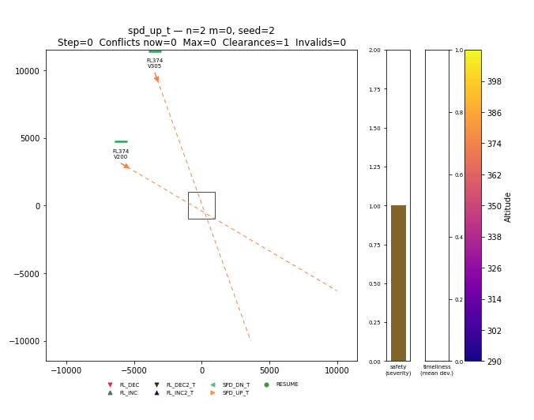

# AirTraffic — the `Flight4DEnv` environment

The environment shared by the Intermediate and Advanced sessions: `n` aircraft
on a collision course plus `m` random background flights, and a policy that
issues speed and flight-level clearances to keep the airspace clear.

This page is what the environment **is**. To train and evaluate an agent on it,
see [Training](training.md) and
[Evaluation](evaluation.md).

!!! info "Prerequisites"
    A working [`rlbootcamp` environment](../setup.md). All commands assume it is
    active and that you are in the package directory:

    ```bash
    cd "sessions/03-advanced/airtraffic"
    ```

---

## What the package contains

```text
airtraffic/
├── envs/                     # the importable Python package
│   ├── __init__.py           #   re-exports + gymnasium.register("Flight4DEnv-v0")
│   ├── flight.py             #   Flight — single-aircraft kinematics
│   ├── simulator.py          #   CollisionCourseSimulator — the physics engine
│   └── flight_4d.py          #   Flight4DEnv — the Gymnasium environment
├── agents/
│   └── rule_based_4d.py      # Priority4DController — the bar to clear
├── policies/
│   └── autoregressive.py     # the default policy: aircraft -> clearance, masked
├── scripts/
│   ├── train_4d.py           # PPO training CLI
│   ├── score_4d.py           # the board: held-out seeds, ranked
│   ├── calibrate_4d.py       # reward-term calibration
│   └── callbacks_4d.py       # curriculum + auto-entropy callbacks
└── tests/                    # the environment contract
```

Three layers, from the bottom up:

| Layer | Class | Role |
|---|---|---|
| Kinematics | `Flight` | One aircraft: position, velocity, heading, altitude; advances one tick. |
| Physics | `CollisionCourseSimulator` | Spawns `n` collision-course + `m` random aircraft; detects congestion. |
| RL interface | `Flight4DEnv` | Wraps the simulator in the Gymnasium API (obs/action/reward/mask). |

See the [Environment API reference](../reference/environment-api.md) for the full
signatures.

---

## The MDP in one screen

| | |
|---|---|
| **Observation** | `Box(shape=(N_FEATS·n_flights + N_GLOBALS + n_actions,))` — 13 features per aircraft, two global scalars (episode clock, clearance budget remaining), and the **legality mask carried inline**. The per-aircraft features are pose `(x, y, alt, vel, sin/cos hdg)`, `dt_exit` (projected minus target exit time), `d_alt` (levels off the entry altitude), the clearances that aircraft has already had, `hold_left` until an active temporary manoeuvre reverts, the severity and timing of its worst **predicted** conflict, and an `active` flag ([details](../reference/environment-api.md)). |
| **Action** | `Discrete(1 + 7·n_flights)` — index 0 idles; index `1 + 7·i + c` issues clearance `c` to aircraft `i`. **At most one aircraft is commanded per step.** The seven clearances are `FL_DEC`, `FL_INC`, `FL_DEC2_T`, `FL_INC2_T`, `SPD_DN_T`, `SPD_UP_T`, `RESUME`; every `_T` variant auto-reverts after `hold_steps`, so the 4D recovery is part of the instruction rather than a second decision. |
| **Reward** | Three **direct per-step costs** — predicted separation severity, 4D exit deviation, and a per-clearance **transition cost** (a property of the action rather than the state) — plus a crash charge covering the steps not flown. These are deliberately *not* potential-based: predicted severity is already dense, so it needs no shaping to be learnable, and the price of saying what we mean directly is that these weights **can** move the optimum, where potential-based shaping provably cannot ([details](../reference/environment-api.md#reward)). |
| **Termination** | A **mid-air** (two co-level aircraft within 100 m) *terminates*. Reaching the horizon or exhausting the clearance budget *truncates* — a truncated state still has a future worth bootstrapping from, a terminal one does not. |
| **Masking** | `action_masks()` is authoritative and removes kinematic dead ends, including clearances that would make the exit slot unreachable even at `v_max`. The same mask is in the observation from `env.mask_offset`, so PPO recomputes log-probabilities against the distribution it actually sampled from. |

The full reward decomposition and exact termination thresholds are in the
[API reference](../reference/environment-api.md).

!!! tip "This is the design surface for Session #3"
    In the Advanced session **you** redesign parts of this MDP — the
    observation, which clearances are allowed, and the reward weighting — to
    climb the competition leaderboard. Start from the
    [Advanced session](index.md).

---

## Step it by hand

```python
import sys; sys.path.insert(0, ".")   # so `import envs` works from sessions/03-advanced/airtraffic/
from envs import Flight4DEnv

env = Flight4DEnv()                          # n + m = 5, n ~ U(2, 4) per reset
obs, info = env.reset(seed=900_000)          # this seed draws n=3, m=2
print("observation shape:", obs.shape)       # (N_FEATS*n_flights + N_GLOBALS + n_actions,)
print("action space:", env.action_space)     # Discrete(1 + 7*n_flights) = Discrete(36)

terminated = truncated = False
total = 0.0
while not (terminated or truncated):
    obs, reward, terminated, truncated, info = env.step(0)   # 0 idles every aircraft
    total += reward
print(f"episode reward (do-nothing baseline): {total:.2f}")
```

!!! note "Why `sys.path.insert(0, ".")`?"
    The package isn't `pip install`-ed; it's imported by path. From inside
    `sessions/03-advanced/airtraffic/`, adding `.` puts the `envs/` package on the import path.

### Or via the Gymnasium registry

Importing `envs` registers the id `Flight4DEnv-v0`:

```python
import envs                      # triggers gymnasium.register(...)
import gymnasium as gym
env = gym.make("Flight4DEnv-v0")
```

---

## Watch a clearance work

Before any code, watch the problem. Every clip below is the **same sector, the
same seed** — two aircraft converging co-level at FL374, closing to within a
metre of each other at step 18 — with three background flights crossing at other
levels. Only the clearances differ.

### First, how to read the picture

<figure markdown>

<figcaption>Do-nothing. The episode <b>terminates at step 18</b>.</figcaption>
</figure>

| What you see | What it means |
|---|---|
| **Solid track behind** each aircraft | where it has flown, coloured by the level it actually held on that stretch |
| **Dashed line ahead** | where it *will* go if nothing touches it — headings are never commanded, so this is a fact, not a guess. It runs exactly as far as the aircraft has left to fly |
| **Dashed circle** between a pair | a predicted encounter that is still legally separated |
| **Solid circle** | an actual loss of separation. Thickness and opacity rise with severity, and the ring fades slowly afterwards so a resolved conflict does not vanish |
| **Black square** | the hotspot — the 1000 m conflict radius |
| **Short coloured tick** above an aircraft | its 4D exit deviation, green (on plan) to red (badly off) |
| **Two bars, right** | the live safety and timeliness costs, read off the *same* `_severity` and `_deviation` the reward uses |
| **Markers** | a clearance, stamped where the aircraft was when it was issued. Triangles are altitude, sideways triangles are speed, a circle is `RESUME` |

The title carries the running `Conflicts now`, `Max`, `Clearances` and
`Invalids`, so the cost of a resolution is on screen while you watch it.

### Three ways to resolve the same conflict

=== "Split the levels"

    

    `FL_INC` on one, `FL_DEC` on the other, then a `RESUME` for each once the
    pair is past. Two levels apart is `ALT_MIN_SEP`, so the conflict is
    **deleted**, not merely reduced.

    **0 congestion events, 4 clearances, `exit_miss` 0.000.** The cleanest
    result on the board and the most expensive — this is what the
    [rule-based baseline](../reference/rule-based-controller.md) does.

=== "One macro"

    

    A single `FL_INC2_T`, issued at step 14. It buys two levels **and** books
    its own return — watch the aircraft come home with no second clearance.

    **2 congestion events, 1 clearance, `exit_miss` 0.000.** A quarter of the
    price, and it does not fully clear the encounter. That gap is the whole
    argument about [when the macro is the right
    tool](../reference/rule-based-controller.md#why-it-does-not-use-the-two-level-macro).

=== "Offset the speeds"

    

    `SPD_DN_T` on one, `SPD_UP_T` on the other. Nobody changes level at all —
    one simply arrives late and the other early, so they are never in the
    hotspot together.

    **5 congestion events, 2 clearances, `exit_miss` 0.035.** Note what you did
    *not* have to do: each pulse is `+dv` for `hold_steps`, then `−dv` for
    `hold_steps`, then nominal, all inside one clearance. The schedule comes
    back by itself, which is what makes this the 4D-neutral resolution.

### The action vocabulary, one clip at a time

The three resolutions above combine clearances. To see what **each
instruction does on its own**, drop the background traffic — `--n-flights 2
--n-range 2 2` puts exactly two aircraft on screen — and issue one clearance to
aircraft 0 at the same step, **14**, four steps before closest approach. Seed 2
draws the *same* converging pair as above (the converging aircraft are generated
before the background ones), so these are the encounter you have already
watched, with the bystanders removed.

=== "do-nothing"

    

    Mid-air at step 18, 3 conflict-steps, `exit_miss` 0.000. Perfectly timely,
    and dead.

=== "FL_INC / FL_DEC"

    

    **One level is not a fix.** The pair still passes 7 m apart horizontally;
    one level keeps it out of the mid-air rule (less than one level apart) and
    inside the conflict rule (`ALT_MIN_SEP` is two). **5 conflict-steps, 1
    clearance, `exit_miss` 0.500** — the aircraft never returns to plan, so
    half the sector is a level off at the exit. `FL_DEC` is the mirror image.

=== "FL_INC2_T / FL_DEC2_T"

    

    Two levels reach `ALT_MIN_SEP`, so the pair leaves the conflict list
    rather than merely fading. **2 conflict-steps, 1 clearance, `exit_miss`
    0.000** — watch `hold_left` count down and the aircraft descend by itself.
    The return is booked with the order and charged once.

=== "SPD_DN_T"

    

    Four steps of −35 m/s move the crossing by 280 m — a wide miss in mid-air
    terms and still squarely inside the 1000 m radius. **5 conflict-steps, 1
    clearance, `exit_miss` 0.000**: the pulse repays its own along-track debt,
    so the 4D exit is untouched. Speed is the slow tool — 70 m per step.

=== "SPD_UP_T"

    

    The mirror of `SPD_DN_T`. **4 conflict-steps, 1 clearance, `exit_miss`
    0.000.**

=== "RESUME"

    

    `FL_INC` at step 14, then `RESUME` at step 24 once the pair is past.
    **5 conflict-steps, 2 clearances, `exit_miss` 0.000** — the same safety as
    the single level, and one more clearance buys the timeliness back. This is
    the pattern the [rule-based controller](../reference/rule-based-controller.md)
    uses.

| clip | ends | conflict-steps | clearances | `exit_miss` |
|---|---|---:|---:|---:|
| do-nothing | mid-air, step 18 | 3 | 0 | 0.000 |
| `FL_INC` / `FL_DEC` | horizon | 5 | 1 | 0.500 |
| `FL_INC2_T` / `FL_DEC2_T` | horizon | 2 | 1 | 0.000 |
| `SPD_DN_T` | horizon | 5 | 1 | 0.000 |
| `SPD_UP_T` | horizon | 4 | 1 | 0.000 |
| `FL_INC` + `RESUME` | horizon | 5 | 2 | 0.000 |

Every column can be won by a different clip, which is why the
[competition](competition.md) ranks them lexicographically rather than adding
them up. The numbers are pinned by `tests/test_render_4d.py`, so a change to
the environment that moves any of them fails a test before it silently dates
this table.

```bash
python scripts/render_4d.py --n-flights 2 --n-range 2 2 --seed 2 --ext gif --fps 4 \
    --agent noop --agent fl_inc --agent fl_dec --agent fl_inc2_t --agent fl_dec2_t \
    --agent spd_dn_t --agent spd_up_t --agent resume
```

!!! tip "The timing is an approximation, and that is the point"
    These scripts issue clearances at fixed steps chosen against this seed's
    geometry. They have to be approximate: the action set is discrete, **only
    one aircraft may be commanded per step**, and a temporary manoeuvre's return
    leg runs on a timer the caller does not control. Deciding *when* is part of
    the problem, not a detail to hide — and it is most of what separates a good
    agent from a bad one.

    Reproduce or re-time any of them:

    ```bash
    python scripts/render_4d.py --agent noop --agent split --agent macro \
        --agent speed --seed 2 --n-range 2 2 --ext gif --fps 4
    ```

---

## Exploring the simulator directly

You can drive the physics engine without the RL wrapper — useful for building
intuition or a rule-based baseline.

```python
import sys; sys.path.insert(0, ".")
from envs import CollisionCourseSimulator

sim = CollisionCourseSimulator(n=6, m=3)      # 6 collision-course, 3 random
colliding_ids, hotspots = sim.find_congestion(sim.flights)
print(f"{len(colliding_ids)} aircraft in detected congestion")

# Save a top-down animation of the whole airspace evolving
sim.animate(save_path="airspace.mp4")          # needs ffmpeg
```

That gives you the raw physics with no policy attached. For a full episode
under an actual agent — with the congestion rings, the exit-gate geometry and
the clearance markers `Flight4DEnv`'s own reward is scored on — use
`scripts/render_4d.py`, described on the
[evaluation page](evaluation.md#rendering-episodes-to-video).

---

## Next

- [**Training an agent**](training.md) — PPO, TensorBoard,
  configuration.
- [**Evaluation & rendering**](evaluation.md) — KPIs,
  videos, recipes.
- [**Rule-based baseline**](baseline.md) — the litmus test the agent
  has to beat.
- [**API reference**](../reference/environment-api.md) — exact spaces and reward
  maths.
